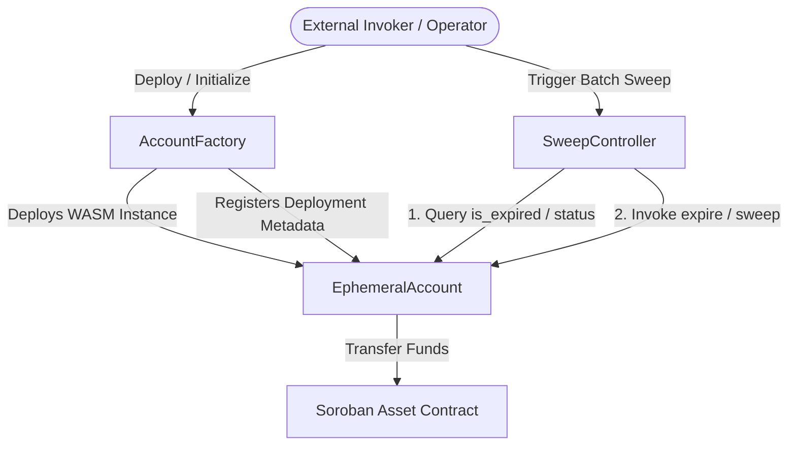

# Threat Model: Cross-Contract Trust Boundaries

**Path:** `bridgelet-audit/threat-models/cross-contract-trust-boundaries.md`  
**Target Repository:** `bridgelet-org/bridgelet-core`  
**Audience:** Security Auditors, Smart Contract Engineers  

---

## 🎯 Purpose

This document maps every cross-contract call made within the `bridgelet-core` workspace. It analyzes the trust assumptions made by callers regarding callees, evaluates whether those assumptions are validated on-chain, and highlights potential failure modes or attack vectors arising from boundary mismatches.

---

## 🗺️ Overall Contract Interaction Graph

---

## 🔍 Core Cross-Contract Boundaries

### 1. `AccountFactory` ➔ `EphemeralAccount`
* **Interaction**: Atomic contract deployment and initialization via `env.deployer().with_current_contract(salt).deploy_v2(...)` and child `initialize()`.
* **Trust Assumption**: The child contract bytecode deployed matches the expected `ephemeral_account_wasm_hash`.
* **Verification**: The factory verifies that `ephemeral_account_wasm_hash` is initialized and immutable once set.
* **Risk & Mitigation**: Frontrunning initialization of the factory is mitigated by deploying and initializing the factory in a single atomic transaction.

### 2. `SweepController` ➔ `EphemeralAccount`
* **Interaction**: `SweepController` invokes `EphemeralAccount::sweep()` or `EphemeralAccount::sweep_claim()` and reads `get_status()`, `is_expired()`.
* **Trust Assumption**: `EphemeralAccount` enforces authorization asserting caller is `authorized_controller` and updates its state to `Swept` prior to transferring funds.
* **Verification**: `EphemeralAccount` validates `controller.require_auth()` and checks `status == Active`.
* **Risk & Mitigation**: Replay and double-spending are blocked by the state transition guard in `EphemeralAccount` and the sweep nonce in `SweepController`.

### 3. `EphemeralAccount` / `SweepController` ➔ `TokenContract` (SEP-41)
* **Interaction**: Invocations of `token::Client::new(env, &asset).transfer(&from, &to, &amount)`.
* **Trust Assumption**: The target asset contract conforms to the SEP-41 / SAC interface and behaves predictably.
* **Verification**: Reentrancy protections and CEI (Checks-Effects-Interactions) patterns ensure state transitions occur before token transfers execute.
* **Risk & Mitigation**: Detailed in [`token-transfer-trust-assumptions.md`](token-transfer-trust-assumptions.md).

---

## 🛡️ Summary of Boundary Protections

1. **Explicit Address Checks**: Contracts enforce that only registered controllers and admins can trigger privileged state mutations.
2. **Atomicity**: All multi-step cross-contract calls execute atomically within a single ledger transaction; failures trigger a complete transaction rollback.
3. **State Isolation**: Each contract maintains its own isolated instance storage, preventing unexpected cross-contract state pollution.
