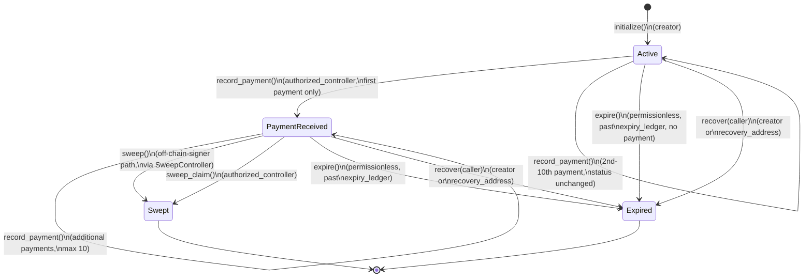

# EphemeralAccount Lifecycle State Diagram (Issue #525)

Source of truth: `contracts/ephemeral_account/src/lib.rs`
(`AccountStatus` from `bridgelet_shared`, and the state-changing entry
points below). This tracks *on-chain* state only — see
`bridgelet-sdk`'s equivalent `account_status` documentation for the
off-chain mirror, which must stay conceptually aligned with this diagram.

## States

| State | Set by |
|---|---|
| `Active` | `initialize` (initial state) |
| `PaymentReceived` | `record_payment`, only on the *first* recorded payment |
| `Swept` | `sweep`, `sweep_claim` (both route through `execute_sweep_core`) |
| `Expired` | `expire`, `recover` (both route through `finalize_expiry`) |

## Diagram

## Transition Notes

- **`sweep` vs `sweep_claim`**: both transition to `Swept` via the shared
  `execute_sweep_core` helper. `sweep` verifies an Ed25519 `auth_signature`
  (off-chain-signer flow); `sweep_claim` requires
  `authorized_controller.require_auth()` directly (Soroban-auth claim flow).
  Both fail once already `Swept`, past `expiry_ledger`, or before any payment.
- **`expire` vs `recover`**: both call the shared `finalize_expiry` helper
  with identical fund-routing/reserve-reclaim. Only the access check
  differs: `expire()` is intentionally permissionless once past
  `expiry_ledger`; `recover(caller)` additionally requires `caller` to be
  the `creator` or `recovery_address`, via `require_auth()`.
- **Reserve reclaim** runs as a side effect of both terminal transitions and
  is separately re-callable (idempotent), so it is not its own state.
- **No transition out of `Swept`/`Expired`** — both are terminal.

## Maintainability

Mermaid `stateDiagram-v2` renders natively on GitHub — no external tooling
needed. Update the table and diagram in the same PR as any change to
`AccountStatus` or its transitions in `lib.rs`.
